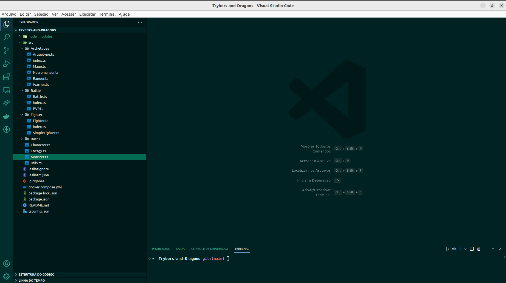

# Projeto Trybers and Dragons

Aplicação dos princípios da arquitetura SOLID e os princípios de POO em uma estrutura de jogos de interpretação de papéis, mais conhecidos como jogos RPG (Role Playing Game).

## Screenshots




## Instalação

Instale Trybers And Dragons com npm

```bash
  git clone git@github.com:nataliakoliveira/Trybers-and-Dragons.git
  cd Trybers-and-Dragons
  npm install
```
    
## Stack utilizada

**Back-end:** TypeScript


## Aprendizados

 - O conhecimento dos pilares da Programação Orientada a Objetos: Herança, Abstração, Encapsulamento e Polimorfismo.

 - A habilidade de criar e utilizar Interface;

 - A habilidade de utilizar Composição;

 - Implementar, em TypeScript, Classes, Instâncias, Atributos, Métodos e Objetos;

 - O conhecimento e aplicação dos princípios SOLID.